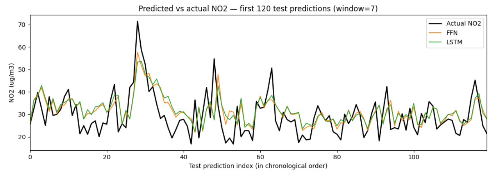
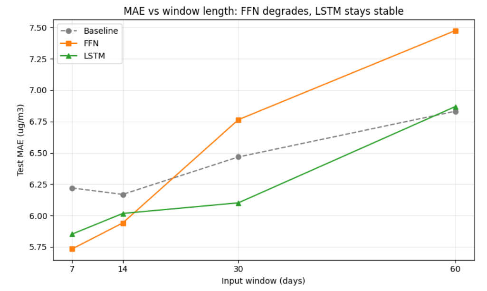
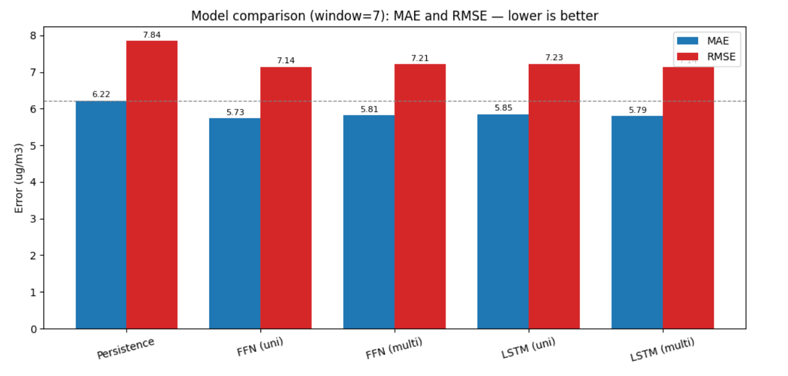

# Forecasting Urban NO2 Air Pollution in Cologne

**MLESS SoSe 2026 - Final Project**
Category: Time-series analysis / (weather-adjacent) forecasting

---

## 1. Motivation & Problem

Nitrogen dioxide (NO2) is a traffic-dominated urban air pollutant with direct
health impacts and a legally binding EU annual limit of 40 ug/m3. Being able to
forecast next-day NO2 at a city monitoring station is useful for public-health
warnings and short-term traffic or policy measures.

**Problem.** Given the recent history of daily-mean pollutant concentrations at a
single Cologne traffic station, forecast the **next-day daily-mean NO2**
concentration (ug/m3). This is a one-step-ahead time-series forecasting task.

**Why it is worth doing.** The chosen station averages 37.5 ug/m3 NO2 - right at
the EU annual limit of 40 - so forecasting exceedances is practically relevant.

---

## 2. Data

### 2.1 Source

| | |
|---|---|
| Dataset | EEA Air Quality In-Situ Measurement Station Data (daily aggregate) |
| Provider | European Environment Agency / J. Heisig |
| DOI | 10.5281/zenodo.14513586 (CC-BY-4.0) |
| File | `..._2.daily_pnt_20150101_20231231_eu_epsg.3035_v20240718.parquet` |
| Size | ~204 MB (the hourly variant is ~4 GB and was deliberately avoided) |
| Coverage | 2015-01-01 to 2023-12-30, daily resolution |

**Scoping decision.** The provider has already reshaped, gap-filled and
aggregated the raw hourly EEA measurements to daily resolution with per-day
coverage flags. Using the 200 MB daily file rather than the 4 GB hourly
partitions keeps download, storage and processing well within the project time
budget, as required.

### 2.2 Station selection

The full file has ~9.3 M rows for all of Europe. Using PyArrow predicate
pushdown, only German rows inside a Cologne bounding box (lon 6.75-7.15, lat
50.80-51.10) were read - 16,646 rows across 7 stations. Coverage per station
(percent of days with a valid value):

| Station | Type | Area | NO2 | PM2.5 | PM10 | O3 | Days |
|---|---|---|---|---|---|---|---|
| **DENW212** | traffic | urban | **100%** | 55% | 63% | 0% | 3120 |
| DENW355 | traffic | urban | 100% | 28% | 49% | 0% | 3016 |
| DENW211 | traffic | urban | 100% | 14% | 77% | 0% | 3165 |
| DENW058 | industrial | suburban | 100% | 7% | 76% | 71% | 1398 |
| DENW079 | background | suburban | 100% | 5% | 45% | 59% | 2083 |
| DENW059 | background | suburban | 100% | 0% | 67% | 57% | 2205 |
| DENW053 | background | urban | 100% | 0% | 62% | 60% | 1659 |

**Chosen: DENW212** (urban traffic, central Cologne). It has 100% NO2 coverage
(clean forecast target), the best PM2.5/PM10 coverage of any station (needed for
the multivariate ablation), and one of the longest records. Traffic + urban is
also the most physically meaningful setting, since NO2 is dominated by vehicle
emissions.

### 2.3 Preprocessing

1. **Date reconstruction.** The file stores `year` and `doy` (day-of-year), not a
   date. A DatetimeIndex was rebuilt as `Jan-1(year) + (doy - 1) days`.
2. **Gap characterization.** DENW212 has 3,120 rows over a 3,286-day span - i.e.
   **166 missing days (~5%)**. NO2 itself has **zero missing values**; PM10 has
   **1,149 missing values (~37%)**.
3. **Gap-aware windowing.** A supervised sample is emitted only when all days in
   the window are strictly consecutive calendar days. This prevents the model
   from learning a "next day" that is really several days later across a gap.
4. **PM10 forward fill.** Requiring PM10 in the windows initially dropped 80% of
   samples (2,474 -> 486), because scattered PM10 gaps poison every overlapping
   window they touch. PM10 was therefore forward-filled (each gap takes the last
   known value). Forward fill is **causal** - it uses only past values, so it
   introduces no future-information leakage. Caveat: long gaps get a stale
   repeated value, weakening the PM10 signal (noted as a limitation).
5. **Standardization.** Feature mean/std were computed on the **training set
   only** and applied to both train and test, avoiding leakage from the test
   period.

---

## 3. Study Design

### 3.1 Forecasting setup

| Parameter | Value | Justification |
|---|---|---|
| Input window | 7 days (main) | One week captures the weekday/weekend traffic cycle |
| Forecast horizon | 1 day | Standard, most actionable short-term forecast |
| Target | NO2 daily mean | 100% coverage, traffic-driven |
| Features (univariate) | NO2 | - |
| Features (multivariate) | NO2 + PM10 | PM10 co-varies with traffic and dispersion |

### 3.2 Train / test split

Chronological by target date: **train = 2015-2021, test = 2022-2023**. A random
split is avoided because it would leak future information into training, which is
invalid for forecasting. At window 7 this yields **2,058 train / 416 test**
windows. The same split is applied to univariate and multivariate data so they
are evaluated on identical days.

### 3.3 Models

- **Persistence baseline:** predict NO2(t+1) = NO2(t). Required simple baseline.
- **FFN:** flatten the window, `Linear(-> 32) -> ReLU -> Linear(-> 1)`. Has no
  notion of time order.
- **LSTM:** reads the window sequentially (hidden size 32), predicts from the
  final time step. Models temporal dependence.

Both nets: MSE loss, Adam (lr = 0.01), 100 epochs, fixed seed (42) for
reproducibility. Targets are standardized for training and predictions are
inverse-transformed to ug/m3 for evaluation. The dataset is small, so training
runs in seconds on CPU.

### 3.4 Ablation

**Varied parameter:** the input feature set - univariate (NO2) vs multivariate
(NO2 + PM10). **Hypothesis:** adding PM10 improves next-day NO2 forecasts,
because the two pollutants share traffic and weather drivers.

### 3.5 Additional experiment: window length

Because the LSTM's advantage should depend on sequence length, the full pipeline
was also run for windows of 7, 14, 30 and 60 days, for both the model comparison
and the ablation.

---

## 4. Evaluation Metrics

| Metric | Why |
|---|---|
| RMSE (ug/m3) | Default; penalizes large errors such as pollution spikes |
| **MAE (ug/m3)** | Metric beyond RMSE; robust to spikes and directly readable as "average ug/m3 off" |

Both metrics are computed in the original ug/m3 scale so they are physically
interpretable and comparable against the baseline.

---

## 5. Results

### 5.1 Main comparison (window = 7)

| Model | Features | MAE | RMSE |
|---|---|---|---|
| Persistence | - | 6.22 | 7.84 |
| FFN | NO2 | **5.73** | **7.14** |
| FFN | NO2+PM10 | 5.81 | 7.21 |
| LSTM | NO2 | 5.85 | 7.23 |
| LSTM | NO2+PM10 | 5.79 | 7.14 |

All four neural models beat persistence (~8-9% lower MAE), confirming they learn
real structure. At this short window they are nearly tied with each other; the
simple univariate FFN is marginally best. The predicted-vs-actual plot shows the
models track everyday NO2 well but **undershoot sudden spikes** (e.g. a real
peak near 72 ug/m3 that the models reach only ~54-57) - a known limitation of
one-step forecasting.

### 5.2 Window-length experiment (test MAE)

| Window | n_train | n_test | Persistence | FFN | LSTM |
|---|---|---|---|---|---|
| 7 | 2058 | 416 | 6.22 | **5.73** | 5.85 |
| 14 | 1749 | 282 | 6.17 | **5.94** | 6.02 |
| 30 | 1230 | 146 | 6.47 | 6.76 | **6.10** |
| 60 | 626 | 27 | 6.83 | 7.47 | **6.87** |

The FFN degrades sharply as the window grows (5.73 -> 7.47) while the LSTM stays
stable (5.85 -> 6.87). The models **cross over** between windows 14 and 30: the
LSTM overtakes the FFN once the input carries enough temporal structure. This
confirms that the LSTM's sequence-modelling advantage only materializes at longer
windows. **Caveat:** longer windows sharply reduce the usable test set (down to
27 samples at window 60), so the longest-window results are suggestive only; the
30-day result (146 samples) is the most reliable evidence of the crossover.

### 5.3 Ablation across windows (test MAE, PM10 effect = multi − uni)

| Window | FFN uni -> multi | LSTM uni -> multi |
|---|---|---|
| 7 | 5.73 -> 5.81 (+0.08) | 5.85 -> 5.79 (-0.06) |
| 14 | 5.94 -> 6.18 (+0.24) | 6.02 -> **5.67** (-0.35) |
| 30 | 6.76 -> 7.10 (+0.34) | 6.10 -> 6.17 (+0.06) |
| 60 | 7.47 -> 7.48 (+0.01) | 6.87 -> 6.81 (-0.06) |

Adding PM10 **consistently harms the FFN** (it cannot structure the extra,
partly-stale feature and treats it as noise). For the **LSTM** the effect is
small but mostly positive, and clearest at window 14, where LSTM+PM10 reaches
**5.67 MAE - the best result in the project**. The effect is not monotonic
(negligible at window 30) and rests on shrinking test sets, so it is reported as
suggestive rather than conclusive.

---

## 6. Conclusions

1. **All neural models beat the naive baseline** (MAE 6.22 -> ~5.7-5.9). The
   improvement is modest because daily NO2 is highly autocorrelated, making
   persistence a strong baseline.
2. **Model choice depends on the window.** The simple FFN is best at short
   windows; the LSTM wins at longer windows once there is enough temporal
   structure to exploit. Hypothesis (LSTM > FFN) is therefore only conditionally
   supported.
3. **PM10 adds little.** The ablation largely falsified the hypothesis: PM10
   harms the FFN and helps the LSTM only marginally (best at window 14). NO2's own
   history already carries most of the signal, and heavy forward-filling diluted
   PM10.
4. **The models miss sudden spikes**, the main practical limitation.

**Overall recommendation:** a univariate NO2 model with a short window is a sound,
simple default; the LSTM and PM10 only pay off under specific conditions. The
negative results are well explained rather than hidden, which was the intended
learning outcome of the project.

---

## 7. Observations (experiences)

- The provider-side gap-filling and daily aggregation removed the hardest part of
  a typical EEA project (assembling per-station hourly files) - the single
  biggest time-saver.
- PyArrow predicate pushdown made a 9.3 M-row file workable without loading it
  fully into memory.
- **Data processing was harder than expected in one respect:** requiring PM10
  silently destroyed 80% of the windows until the forward-fill fix - a good
  reminder to inspect sample counts after every preprocessing step.

---

## 8. Limitations & Future Work

- Longer windows shrink the usable sample count (27 test points at window 60), so
  those results are indicative only.
- PM10 needed heavy forward-filling; a station with better PM10 coverage would
  give a cleaner ablation.
- Future work: add weather inputs (wind, temperature), or extend to a
  multi-station spatial model across NRW's 68 stations (all with 100% NO2
  coverage).

---

## 9. Reproducibility

The implementation lives in reusable modules under `src/`
(`data_processing.py`, `models.py`, `evaluate.py`). The core results can be
reproduced from the command line:

```bash
pip install -r requirements.txt
# place the Zenodo daily parquet in data/
python main.py data/<daily_parquet_filename>.parquet
```

`main.py` runs the data pipeline, the persistence baseline, the FFN and LSTM
(univariate), and the PM10 ablation, then prints the results table. The full
study - including exploratory analysis, the window-length experiment and all
plots - is in `notebooks/CODE_MLESS_2026.ipynb`. Running
`python src/data_processing.py <parquet>` alone prints the station-coverage table
and split counts.

Random seeds are fixed (42); all metrics are reported on the 2022-2023 test set.
Neural-network metrics may still vary by a small margin (~0.1 MAE) across machines
or PyTorch versions due to floating-point and initialization differences; the
values reported here are from the notebook run.


## Figures

**Figure 1 - Predicted vs actual NO2 (first 120 test predictions, window 7).**
The models track everyday NO2 well but undershoot sudden spikes.



**Figure 2 - MAE vs input window length.**
The FFN degrades as the window grows while the LSTM stays stable, crossing over
around window 30.



**Figure 3 - Model comparison (window 7), MAE and RMSE.**
All neural models beat the persistence baseline; at a short window they are
nearly tied.




